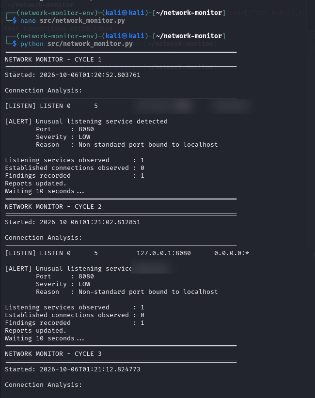
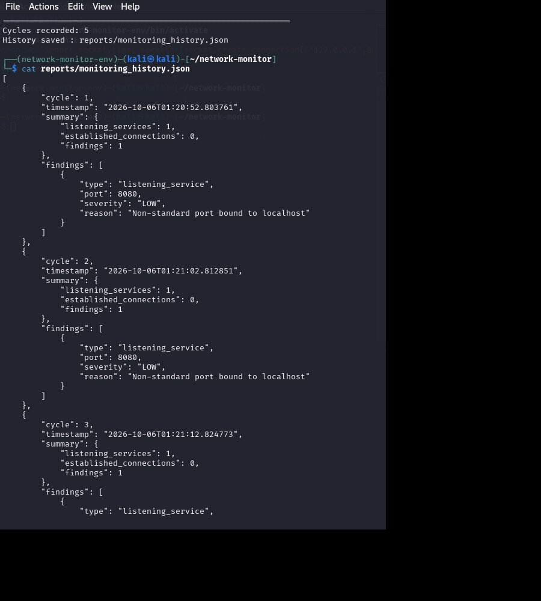
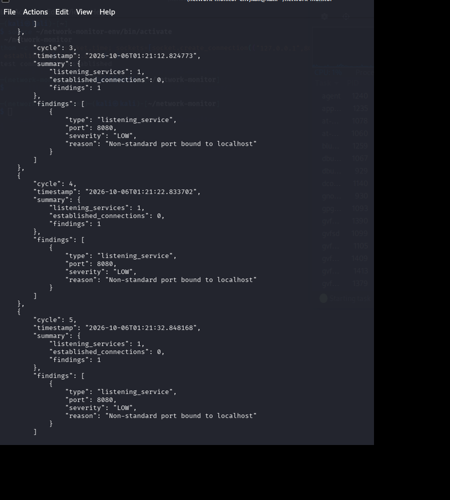

# 🛡️ Network Monitoring & Alerting System

## 📌 Overview
This project demonstrates basic network monitoring and rule-based alerting using Python in a Kali Linux environment. The objective was to monitor TCP network activity, identify listening services, detect unusual ports, classify findings based on severity, and generate structured monitoring reports.

---

## 🧪 Scenario
A controlled local test environment was used to generate network activity. A local service was started and monitored to observe listening and established TCP connections.

---

## ⚙️ Tools Used
- Kali Linux
- Python
- Linux `ss` utility
- JSON
- VirtualBox

---

## 🚀 What I Did
- Built a Python-based network monitoring tool
- Monitored TCP listening and established connections
- Distinguished between `LISTEN` and `ESTAB` network states
- Created rule-based detection for non-standard listening ports
- Assigned severity based on the context of the detected service
- Generated structured JSON monitoring reports
- Maintained monitoring history across multiple monitoring cycles

---

## 📸 Screenshots

### 🔹 Monitoring & Alert Detection

### 🔹 Monitoring History

### 🔹 Monitoring Session Summary

---

## 🧠 Key Findings
- Listening services were successfully identified and monitored
- TCP connection states were successfully distinguished
- A non-standard listening port was detected by the monitoring rule
- The finding was classified as LOW severity because the test service was bound to localhost
- Monitoring results were stored in structured JSON format
- Multiple monitoring cycles were preserved for historical review

---

## 🧠 Key Learnings
- Understanding TCP network connection states
- Monitoring listening services and network ports
- Building rule-based detection logic using Python
- Applying basic severity classification
- Generating structured security monitoring reports
- Maintaining historical monitoring data

---

## 🚀 Future Improvements
- Add configurable detection rules
- Introduce additional severity levels
- Add CSV report generation
- Improve alert filtering
- Develop a dashboard for monitoring visualization

---

## ⚠️ Disclaimer
This project was developed and tested in a controlled local laboratory environment for educational purposes only.
